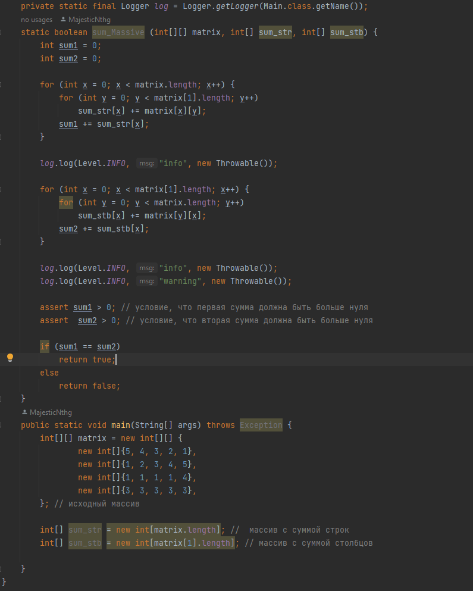

# Отладка и логирование
---
## Отладка

### Точка прерывания на 25 строке, текущие значения программы на этот момент

### Точка прерывания на 25 строке, значения консоли на данный момент

### Точка прерывания на 27 строке, текущие значения программы на этот момент 

### Точка прерывания на 27 строке, значения консоли на данный момент

## UPD
### Ассерты

Добавленные ассерты на 48 и 49 строке.

### Функция

Оформленный код в функцию.

### Вывод в консоль + вывод функции

Изменил вывод функции со строки на булево значение + убрал вывод в консоль по ходу кода
